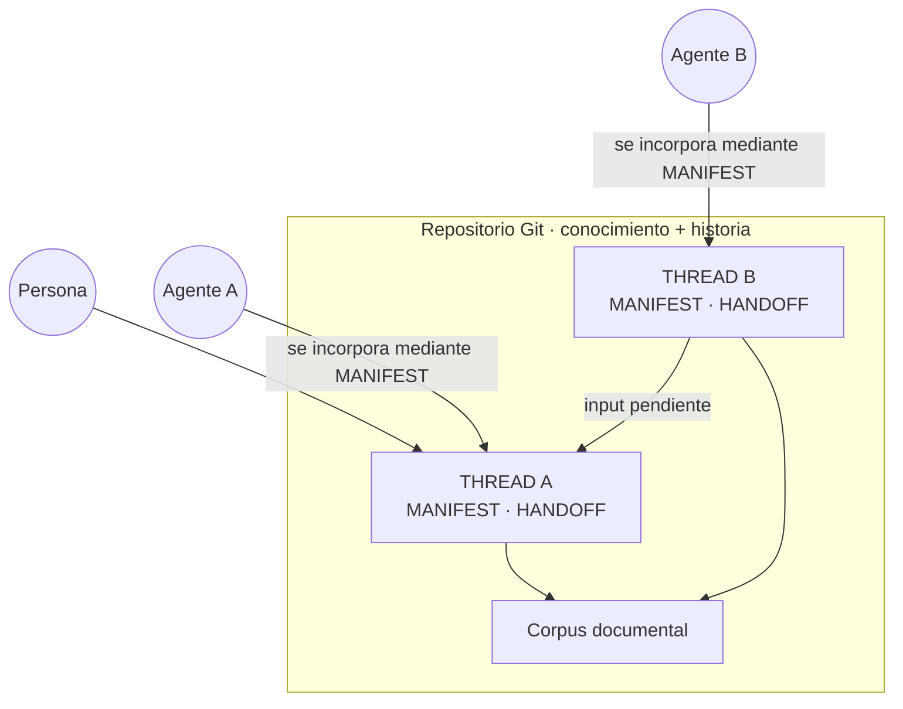

# Warp

> Arquitectura de conocimiento para coordinar trabajo entre personas y agentes de IA sin depender de la memoria de una conversación concreta.

Warp es una metodología y una arquitectura de trabajo basada en Git. Su objetivo es mantener **conocimiento, responsabilidad y estado** de forma persistente cuando un proyecto se reparte entre múltiples conversaciones, agentes o herramientas que no comparten memoria entre sí.

La idea base es sencilla:

> **la conversación es efímera; el repositorio es la memoria durable.**

Warp no nació como un ejercicio abstracto de arquitectura. Surgió durante la investigación **Design to Code**, al comprobar que una metodología por etapas podía estructurar bien el proceso, pero no resolvía por sí sola un problema distinto: **cómo coordinar contextos aislados sin perder coherencia, trazabilidad ni responsabilidad**.

→ Investigación de origen: [Design to Code](https://github.com/gineslm/design-to-code)

---

## 1. El problema

Trabajar con agentes de IA produce conocimiento útil, pero ese conocimiento suele quedar repartido entre conversaciones:

- una instancia investiga;
- otra diseña;
- otra implementa;
- otra revisa;
- ninguna comparte automáticamente la memoria de las demás.

Cuando el trabajo crece aparecen varios síntomas:

- decisiones repetidas o contradictorias;
- contexto que hay que reconstruir una y otra vez;
- dificultad para saber cuál es el estado vigente;
- responsabilidades mezcladas dentro de una misma conversación;
- dependencia excesiva de la memoria del agente o de la persona que estuvo presente;
- conocimiento importante atrapado en historiales conversacionales.

El problema no es sólo de almacenamiento.

Es también de **responsabilidad**:

> ¿quién puede cambiar qué?, ¿cómo llega una propuesta a quien tiene autoridad para resolverla?, ¿cómo se incorpora un agente nuevo sin rehacer toda la historia?

Warp intenta responder a esas preguntas con un modelo pequeño y explícito.

---

## 2. De dónde surge

La investigación [Design to Code](https://github.com/gineslm/design-to-code) estudiaba un flujo asistido por agentes:

```text
definición
   ↓
diseño
   ↓
implementación
```

De ese trabajo se extrajo una metodología basada en principios como:

- reducción de ambigüedad;
- trazabilidad;
- enriquecimiento acumulativo;
- gates de validación;
- retroactividad controlada;
- contratos entre etapas.

Mientras esa metodología se desarrollaba, el trabajo empezó a repartirse entre múltiples conversaciones y herramientas.

Ahí apareció un problema de segundo orden:

> **las instancias no comparten memoria y el estado del proyecto puede desincronizarse.**

El primer intento de resolverlo utilizó documentos-puente, estados y sincronización humana.

Warp nace al separar ese problema del flujo design-to-code y convertirlo en una cuestión arquitectónica independiente:

> **¿cómo mantener conocimiento y responsabilidad coherentes cuando múltiples agentes trabajan sobre un mismo proyecto a lo largo del tiempo?**

---

## 3. La idea: tejer conocimiento

El nombre viene del telar.

La **urdimbre** (*warp*) es el conjunto de hilos paralelos tensados sobre el bastidor que da estructura a todo lo que se teje encima.

En Warp, cada **THREAD** es una línea persistente de responsabilidad.

El conocimiento se construye alrededor de esos THREADs.

Git conserva la historia.

Los agentes son temporales e intercambiables.



---

## 4. El modelo

Warp separa explícitamente varias cosas que suelen mezclarse:

```text
unidad de trabajo
      ↓ 
unidad de conocimiento
      ↓ 
unidad de autoridad
      ↓ 
agente que trabaja
```

Sus piezas principales son:

### THREAD

Una línea persistente de responsabilidad.

No es una conversación, una persona ni un agente.

Un THREAD existe si y sólo si existe su **MANIFEST**.

Puede seguir vivo aunque cambie el agente que trabaja sobre él.

Puede cerrarse y reabrirse.

---

### MANIFEST

El contrato actual del THREAD.

Declara lo que Git no puede inferir por sí solo:

- identidad;
- responsabilidad;
- estado;
- alcance;
- autoridad documental;
- dependencias relevantes;
- HANDOFF asociado.

El agente se incorpora al THREAD leyendo su MANIFEST.

---

### HANDOFF

La bandeja de entrada persistente de un THREAD.

Contiene exclusivamente **inputs pendientes procedentes de otros THREADs**:

- propuestas;
- revisiones;
- necesidades;
- tareas inter-THREAD.

El trabajo propio del THREAD no se encola en su propio HANDOFF.

El THREAD receptor evalúa y resuelve cada entrada.

Cuando una entrada se resuelve, se elimina en el mismo commit que aplica o registra la decisión.

Por tanto:

```text
HANDOFF = presente pendiente
Git      = pasado resuelto
```

---

### Corpus documental

El corpus es común para lectura.

Cualquier THREAD puede consultar el conocimiento que necesita.

Pero cada documento tiene una **autoridad única de evolución**.

```text
lectura
→ global

edición
→ autoridad explícita
```

Si un THREAD necesita modificar conocimiento bajo autoridad de otro, no edita directamente: propone el cambio a través del HANDOFF del THREAD responsable.

---

### Git

Git es el sustrato histórico.

Conserva:

- autoría;
- fechas;
- diffs;
- estados anteriores;
- evolución de las decisiones.

Warp evita duplicar manualmente información que Git ya conoce.

---

## 5. Cómo se mueve el conocimiento

La regla básica es:

```text
THREAD A
  ↓
  ↓ necesita cambiar conocimiento bajo autoridad de B
  ↓
HANDOFF B
  ↓
  ↓
THREAD B evalúa
  ↓
  ↓
documento bajo autoridad de B
```

Esto permite que el conocimiento sea transversal sin convertir la edición en una responsabilidad compartida y ambigua.

Cuando un documento es transversal y ninguna responsabilidad existente debería dominarlo, Warp contempla crear un THREAD específico de gestión con autoridad única sobre ese documento.

---

## 6. Agentes intercambiables

El agente no es la memoria del proyecto.

Un agente nuevo debería poder reconstruir el contexto necesario desde el repositorio:

```text
contexto mínimo
      ↓
índices
      ↓
MANIFEST
      ↓
HANDOFF
      ↓
corpus relevante
```

Esto permite cambiar de:

- conversación;
- instancia;
- modelo;
- herramienta;

sin redefinir el THREAD.

El agente es un actor temporal.

La responsabilidad persiste.

---

## 7. Superficie mínima

Warp adopta **divulgación progresiva**.

Un agente no carga por defecto toda la arquitectura ni todas las reglas.

Lee sólo lo necesario para el trabajo ordinario y consulta documentación más extensa cuando la operación lo exige.

La superficie de entrada es:

```text
PROJECT_AGENT_CONTEXT
        ↓
THREAD_INDEX / DOCUMENT_INDEX
        ↓
MANIFEST
        ↓
HANDOFF
        ↓
corpus relevante
```

Las reglas completas se cargan bajo demanda para operaciones como:

- crear un THREAD;
- cambiar autoridad documental;
- resolver HANDOFFs;
- cerrar o reabrir responsabilidades;
- modificar la propia arquitectura.

Reducir contexto no reduce obligaciones.

---

## 8. Validación estructural

Las invariantes que pueden comprobarse mecánicamente no deberían depender sólo de disciplina manual.

Warp incluye:

```bash
python scripts/check_knowledge.py
```

El comprobador valida, entre otras cosas:

- existencia y coherencia de THREADs;
- relación MANIFEST → HANDOFF;
- consistencia de índices;
- autoridad documental declarada;
- referencias a archivos;
- estructura reconocible de entradas HANDOFF;
- patrones básicos de secretos.

El checker no sustituye juicio humano.

No decide si:

- una responsabilidad está bien formulada;
- una decisión es correcta;
- un cambio pertenece conceptualmente a un THREAD;
- una dependencia semántica es válida.

Automatiza estructura, no criterio.

---

## 9. Principios de diseño

### Un commit = una decisión

El commit intenta representar una unidad coherente de cambio.

Su mensaje explica por qué cambia el conocimiento, no sólo qué líneas se editaron.

### Git guarda la historia; los documentos representan el presente

No se mantiene un segundo historial manual encima de Git.

### Lectura global, autoridad de escritura explícita

El corpus puede ser común sin que la capacidad de modificarlo sea difusa.

### Agentes intercambiables

El sistema no depende de conservar una conversación concreta.

### HANDOFF sólo inter-THREAD

El trabajo propio se resuelve dentro del THREAD y se materializa directamente en documentos bajo su autoridad.

### Procedencia explícita sólo cuando aporta significado

Autoría editorial, fecha y diff ya viven en Git.

Las relaciones de procedencia que sí tienen significado epistemológico pueden declararse explícitamente.

### Carga progresiva de contexto

Se lee lo mínimo necesario y se amplía sólo cuando la operación lo requiere.

---

## 10. Qué no es Warp

Warp no pretende ser:

- una plataforma multiagente;
- un orquestador autónomo;
- una memoria vectorial para LLMs;
- un sistema de tickets;
- un sustituto de Git;
- un Knowledge Graph;
- una afirmación de haber inventado primitivas inéditas.

Es una arquitectura de trabajo para **producción y evolución de conocimiento durable con agentes**.

---

## 11. Relación con Design to Code

Design to Code y Warp forman parte de la misma genealogía, pero responden a preguntas distintas.

### Design to Code

Pregunta principal:

> **¿cómo debe avanzar y validarse un proceso asistido por agentes?**

Resultado:

- investigación experimental;
- metodología por etapas;
- contratos entre capas;
- reducción de ambigüedad;
- trazabilidad;
- gates;
- specs;
- evaluación de fidelidad y replicabilidad.

### Warp

Pregunta principal:

> **¿cómo mantener conocimiento y responsabilidad coherentes cuando múltiples agentes trabajan sin compartir memoria?**

Resultado:

- THREADs persistentes;
- MANIFESTs;
- HANDOFFs;
- autoridad documental;
- corpus común;
- Git como historia;
- agentes intercambiables;
- superficie mínima;
- validación estructural.

La relación puede resumirse así:

```text
Design to Code
→ investiga un proceso
→ extrae una metodología
→ descubre un problema de coordinación

Warp
→ toma ese problema
→ lo abstrae
→ desarrolla una arquitectura de conocimiento
```

→ [Ver Design to Code](https://github.com/gineslm/design-to-code)

---

## 12. Evaluación crítica

Warp no inventa desde cero conceptos como:

- ownership;
- memoria compartida;
- bounded contexts;
- decision records;
- message passing;
- trazabilidad;
- gobernanza federada;
- versionado como historial.

El modelo se contrastó posteriormente con familias como:

- DDD / Bounded Contexts;
- Data Mesh;
- ADR;
- RFC;
- IBIS;
- W3C PROV;
- Team Topologies;
- arquitecturas Blackboard;
- sistemas basados en Git.

El interés de Warp no está en reclamar una primitiva inédita.

Está en la **síntesis** aplicada a un problema concreto de colaboración humano–IA y en hacer explícita la separación entre:

```text
responsabilidad
conocimiento
autoridad
agente
historia
```

Construir la arquitectura fue también un instrumento de investigación: permitió entender desde dentro las decisiones antes de compararlas con modelos existentes.

---

## 13. Estado

Warp se publica como una metodología pequeña y legible, no como una plataforma.

El core incluye:

- arquitectura;
- reglas operativas;
- bootstrap de agentes;
- contexto mínimo;
- reglas Git;
- plantillas;
- índices;
- comprobador de coherencia;
- ejemplo mínimo.

Las líneas futuras quedan fuera del core actual:

- CI automático del checker;
- avisos de dependencias;
- consulta semántica del corpus;
- posible proyección en grafo;
- experimentación con múltiples usuarios y roles.

---

## 14. Estructura del repositorio

```text
.
├── README.md
├── LICENSE
│
├── docs/
│   ├── core/
│   │   ├── THREAD_ARCHITECTURE.md
│   │   ├── PROJECT_WORKING_RULES.md
│   │   ├── THREAD_CONTEXT_BOOTSTRAP.md
│   │   ├── PROJECT_AGENT_CONTEXT.md
│   │   ├── GIT_COMMIT_RULES.md
│   │   ├── THREAD_INDEX.md
│   │   ├── DOCUMENT_INDEX.md
│   │   └── *_TEMPLATE.md
│   │
│   └── threads/
│       └── example/
│           ├── MANIFEST.md
│           └── HANDOFF.md
│
└── scripts/
    └── check_knowledge.py
```

---

## 15. Licencia

Warp se distribuye bajo licencia dual: el código (`scripts/`) bajo **MIT**, y la documentación y metodología (`docs/`, `README.md`) bajo **CC BY-SA 4.0**.

Consulta [`LICENSE`](LICENSE), [`LICENSE-CODE`](LICENSE-CODE) y [`LICENSE-DOCS`](LICENSE-DOCS).

---

## Autor

**Ginés López Montalbán**

Product Design / UX-UI · Frontend · Design Systems · procesos y colaboración con agentes de IA
