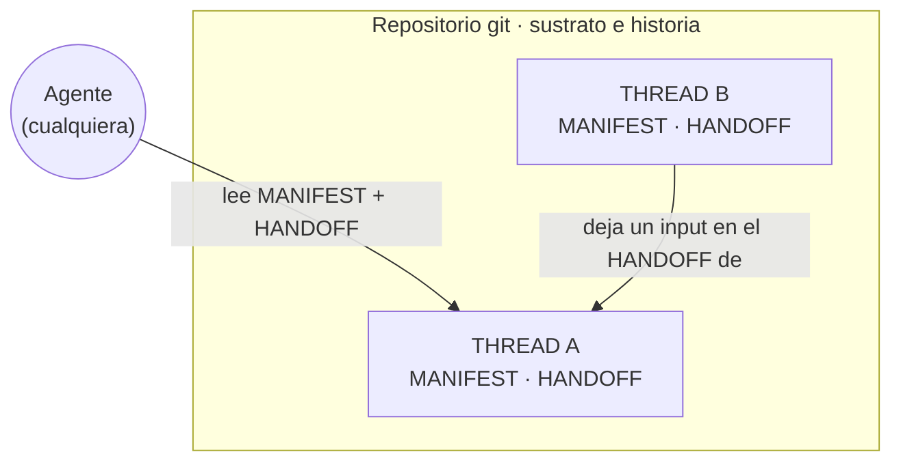

# Warp

> Una arquitectura para gestionar el conocimiento que se produce trabajando con agentes de IA — donde el conocimiento vive en el repositorio, no en la conversación.

Warp es una metodología (no un producto) para que varios agentes de IA y una persona construyan conocimiento de forma ordenada, duradera y auditable, usando git como sustrato. Este documento cuenta el problema que resuelve, el modelo, las decisiones de diseño y una evaluación honesta frente a lo que ya existe.

---

## El problema

Trabajar con agentes de IA produce mucho conocimiento valioso, pero ese conocimiento se queda atrapado en las conversaciones: se pierde al cerrar el chat, se contradice entre sesiones y no hay forma de que un segundo agente retome el hilo sin que se lo expliquen otra vez. Cuando además intervienen varios agentes sobre un mismo proyecto, aparece un problema de coordinación: ¿quién es responsable de qué?, ¿cómo se entera una línea de trabajo de que otra ha decidido algo que le afecta?, ¿cuál es el estado *actual* frente a lo que fue cierto hace tres sesiones?

Warp parte de una idea sencilla: **la conversación es efímera; el repositorio es la memoria.** El conocimiento durable debe vivir en documentos versionados en git, no en el contexto de ningún agente.

---

## La idea: tejer conocimiento

El nombre viene del telar. La **urdimbre** (*warp*) es el conjunto de hilos paralelos, tensados sobre el bastidor, que dan estructura a todo lo que se teje encima.

En esta arquitectura, cada **THREAD** es un hilo de la urdimbre: una línea de responsabilidad estable. El conocimiento se teje sobre esos hilos, y **git** es el bastidor que lo sostiene y conserva su historia. Cualquier agente puede acercarse al telar y seguir tejiendo un hilo concreto, porque el estado de cada hilo está escrito, no en la memoria de quien tejía antes.

---

## El modelo

Cuatro piezas, en lenguaje llano:

- **THREAD** — una línea de responsabilidad (no una conversación, ni una persona, ni un agente). Es la unidad que persiste. Regla base: *un THREAD existe si y solo si existe su documento de identidad (MANIFEST).*
- **MANIFEST** — el estado *presente* de un hilo: quién responde, en qué situación está, su alcance. Guarda solo lo que git no puede saber por sí mismo.
- **HANDOFF** — la bandeja de entrada del hilo. Es donde *otros* hilos dejan aportaciones (una propuesta, una revisión, una tarea) con su evidencia. Solo el dueño del hilo las resuelve; al resolverlas, la entrada se retira en el mismo commit que aplica el cambio, y git conserva el rastro.
- **git** — el sustrato: toda la historia y la procedencia. Nada se anota a mano si git ya lo guarda.

Los agentes son intercambiables: cualquiera se incorpora a un hilo leyendo su MANIFEST y su HANDOFF. La arquitectura es agnóstica respecto a qué agente hace el trabajo.

---

## Principios de diseño

Las decisiones importan más que las piezas. Estas son las que sostienen Warp, con su porqué:

- **Un commit = una decisión.** El historial cuenta *por qué* cambió algo, no qué línea se editó. El commit es la unidad de conocimiento, no el documento.
- **La procedencia la da git, no se anota a mano.** Fechas, autoría, qué cambió y cuándo: git ya lo guarda sin fallar. Duplicarlo a mano solo introduce contradicciones con el tiempo.
- **Superficie mínima para el agente.** El agente lee por defecto lo justo (a qué hilo se conecta y su estado) y consulta el resto solo cuando la tarea lo pide. El texto largo degrada el rendimiento de un agente y encarece cada tarea; menos es más.
- **Que lo compruebe una herramienta, no la buena voluntad.** Un validador revisa automáticamente que la estructura cuadre (cada hilo con su identidad, referencias que existen, sin incoherencias). Lo que puede fallar por descuido, se comprueba.

---

## Evaluación crítica: qué hay ya y en qué se diferencia

Warp no inventa primitivas nuevas, y conviene decirlo con claridad. Se apoya, a conciencia, en ideas con años de recorrido:

| | Guarda estado en git | Estado presente derivado de historia inmutable | Interfaz para agentes | Orientación |
|---|---|---|---|---|
| **git-bug / Fossil** | sí (desde hace ~20 años) | sí | no | incidencias / desarrollo de software |
| **Zettelgeist** | sí | sí | sí (MCP) | seguimiento de trabajo / código |
| **Warp** | sí | sí | sí | **conocimiento de dominio durable** |

- **git-bug y Fossil** llevan casi dos décadas guardando incidencias y tickets dentro del control de versiones y calculando el estado actual a partir de eventos inmutables. Warp aplica esa misma lógica a la coordinación de conocimiento entre agentes.
- **Zettelgeist** es casi un gemelo (markdown como fuente de verdad, cada acción un commit, validador, interfaz de agente). Warp se diferencia en dos cosas: una **ontología de responsabilidad** explícita (autoría única por documento; el THREAD como responsabilidad con ciclo de vida) y una orientación a **conocimiento durable**, no a tickets de código que se cierran.
- En comunicación entre agentes, el campo ha convergido en dos principios —"un mensaje entre agentes es un sobre estructurado, no prosa vaga" y "carga poco contexto por defecto"— y Warp los adopta deliberadamente.

**Conclusión honesta:** el valor de Warp no está en una pieza inédita, sino en la *síntesis* y en su propósito. Es un vehículo para pensar, con rigor y sobre trabajo real, cómo colaboran una persona y varios agentes sin perder la cabeza ni la trazabilidad.

---

## Naturaleza del proyecto

Warp es un proyecto de investigación y pensamiento, no un producto con usuarios. Se forjó sobre un proyecto de dominio real y todavía en curso —un análisis de zonas de refugio climático en España—: la metodología no nació en un ejemplo de laboratorio, sino resolviendo el desorden de un trabajo vivo. Esa es, precisamente, su prueba de esfuerzo.

---

## Qué hay detrás de este trabajo

Diseñar Warp implicó pensar en sistemas (cómo se estructura y fluye el conocimiento entre responsabilidades), diseñar la colaboración entre personas y agentes de IA a nivel de arquitectura, tomar decisiones de ingeniería con criterio (git como sustrato, versionado, validación automática) y —quizá lo menos común— someter el propio diseño a una evaluación crítica frente al estado del arte antes de defenderlo.

---

## Licencia

Sugerencia: documentación bajo **CC BY 4.0** y cualquier código de utilidad bajo **MIT** o **Apache-2.0**. Ajústalo a tu preferencia antes de publicar.

---

## Autor

**Ginés López Montalbán** — Product Design UX/UI · Frontend Developer.
Perfil híbrido: diseño, desarrollo frontend y trabajo con agentes de IA.
LinkedIn: `in/gines-lopez-design`
